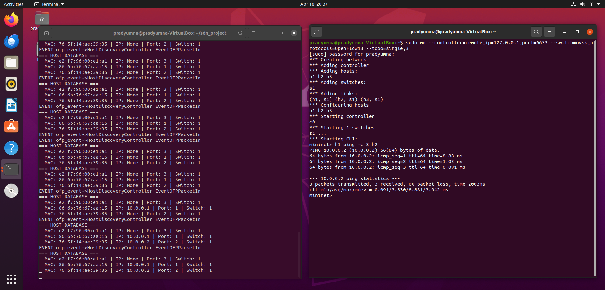
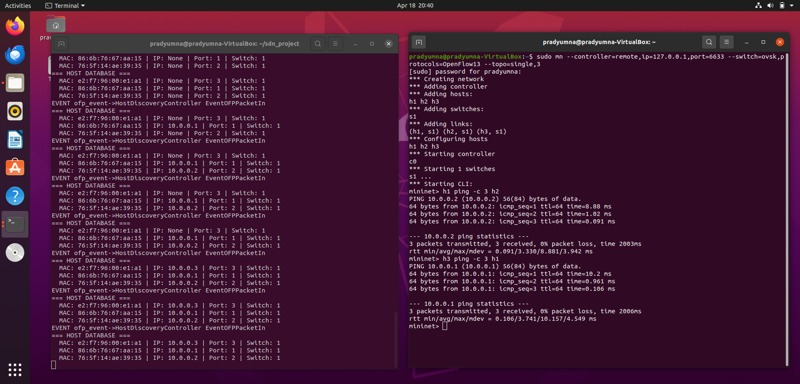
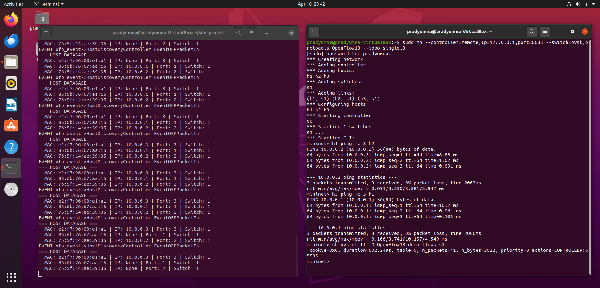
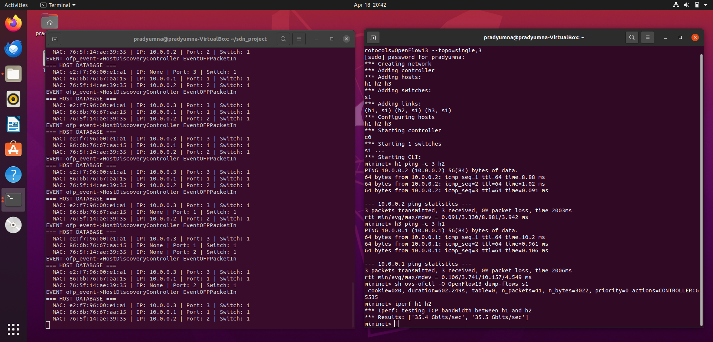

# SDN Host Discovery Service

## Problem Statement
In Software Defined Networks (SDN), the controller has no automatic knowledge of hosts connected to the network. This project implements a **Host Discovery Service** using Mininet and Ryu OpenFlow controller that automatically detects hosts when they join the network, maintains a real-time host database, and enables packet forwarding using learned MAC addresses.

## Topology
- 1 OpenFlow switch (s1)
- 3 hosts (h1, h2, h3)
- 1 Remote Ryu Controller

## Features
- Detects new hosts on first packet
- Maintains host database (MAC, IP, Port, Switch)
- Installs flow rules dynamically
- Updates host info in real time

## Requirements
- Ubuntu 20.04
- Mininet 2.2.2
- Ryu Controller
- Python 3.8+
- Open vSwitch

## Setup & Installation

### 1. Install Mininet
```bash
sudo apt install mininet -y
```

### 2. Install Ryu
```bash
pip3 install ryu
pip3 install eventlet==0.30.2
```

### 3. Clone this repository
```bash
git clone https://github.com/prady2212/sdn-host-discovery.git
cd sdn-host-discovery
```

## Execution Steps

### Terminal 1 — Start Ryu Controller
```bash
ryu-manager host_discovery_controller.py --verbose
```

### Terminal 2 — Start Mininet
```bash
sudo mn --controller=remote,ip=127.0.0.1,port=6633 --switch=ovsk,protocols=OpenFlow13 --topo=single,3
```

## Test Scenarios

### Scenario 1 — Host Discovery (h1 pings h2)
```bash
mininet> h1 ping -c 3 h2
```
Expected: Controller detects h1 and h2, adds them to host database

### Scenario 2 — New Host Joins (h3 pings h1)
```bash
mininet> h3 ping -c 3 h1
```
Expected: h3 detected and dynamically added to host database

### Scenario 3 — Flow Table Check
```bash
mininet> sh ovs-ofctl -O OpenFlow13 dump-flows s1
```

### Scenario 4 — Throughput Test
```bash
mininet> iperf h1 h2
```

## Expected Output
- Controller terminal shows `NEW HOST DETECTED` with MAC, IP, Port, Switch info
- HOST DATABASE updates dynamically as hosts communicate
- Ping shows 0% packet loss
- iperf shows ~35 Gbits/sec throughput

## Proof of Execution

### Screenshot 1 — Host Discovery & Ping Results


### Screenshot 2 — Host Database Update


### Screenshot 3 — Flow Table & iperf


### Screenshot 4 — Full Demo


## SDN Concepts Demonstrated
- **packet_in events** — unmatched packets sent to controller
- **match-action rules** — flow rules installed based on MAC learning
- **Table-miss entry** — priority 0 rule sends all unknown packets to controller
- **Flow installation** — priority 1 rules installed for known hosts with idle_timeout=10

## References
1. Ryu SDN Framework Documentation — https://ryu.readthedocs.io
2. Mininet Documentation — http://mininet.org
3. OpenFlow 1.3 Specification — https://opennetworking.org
4. Open vSwitch Documentation — https://www.openvswitch.org
